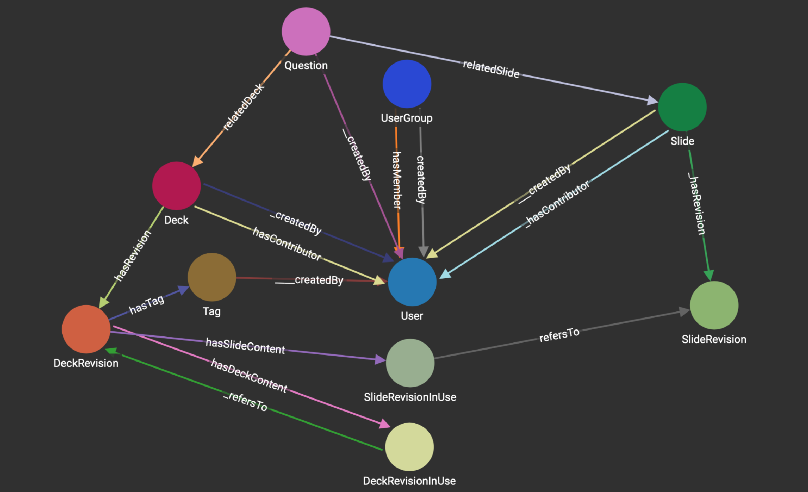

# SlideWiki MongoDB JSON to RDF
converts SlideWIki MongoDB schemas to RDF

# how to use
1. copy the JSON dump of MongoDB in the data folder (new line separated JSON objects)

  to get the json dump you can use `mongoexport --host [host_ip] -d [dbname] -c [collection] > data/[collection].txt`

2. run the following scripts to perform the conversion

  node [the name of convertor].js > data/[the name of rdf file].ttl

  e.g.

 `node decksToRDF.js > data/decks.ttl`

 `node tagsToRDF.js > data/tags.ttl`

 `node usergroupsToRDF.js > data/usergroups.ttl`

 `node slidesToRDF.js > data/slides.ttl`

 `node usersToRDF.js > data/users.ttl`

3. import data to your triple store

4. run post processing queries specified in [postprocessingQueries.md](postprocessingQueries.md)
